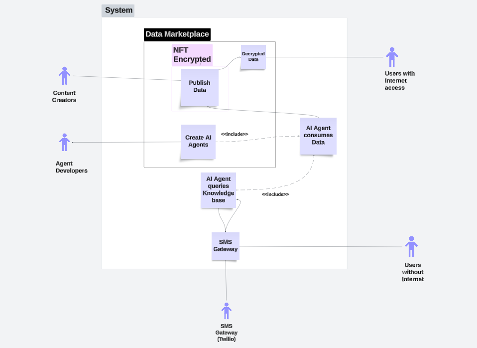

<a href="https://zero-ai-gray.vercel.app/">
  
  <h1 align="center">ZeroAI</h1>
</a>

<p align="center">
 Making Information Accessible Anywhere, for Everyone with Zero Internet
</p>

## Overview

ZeroAI is a decentralized solution that provides offline access to AI agents, empowering millions of users in remote or underserved areas with limited internet connectivity to access vital information and knowledge via SMS chats. It leverages Filecoin for secure storage, NFTs for content access, and integrates with The Graph for reliable data management and connectivity.

## Features

- **User-Friendly SMS:** Easily ask questions and receive intelligent answers via text messages.
- **Offline AI Access:** AI agents provide responses via SMS, even without the internet.
- **Decentralized Marketplace:** Securely publish and share AI-driven content using Filecoin for storage.
- **Decentralized Storage:** Content is securely stored on Filecoin for decentralized management.
- **Secure Data Access:** Uses NFT contracts to ensure only authorized users can access and decrypt data.
- **Simple Addressing:** Access AI agents via short, memorable names (ENS names) or phone numbers.
- **Monetization for Content Creators:** Enables creators to monetize their data by publishing content on the marketplace and securing it with NFTs.

## Tech Stack

- [Solidity](https://soliditylang.org/): Smart contract language for the ZeroAI platform.
- [Hardhat](https://hardhat.org/): Development environment for smart contracts.
- [Lit Protocol](https://litprotocol.com/): Lit is an internet native security and identity network.
- [Filecoin](https://filecoin.io/): Secure storage for AI content.
- [The Graph](https://thegraph.com/): Decentralized data management and querying.
- -[Apollo Client](https://www.apollographql.com/docs/react/): GraphQL client for the ZeroAI platform.
- [Express](https://expressjs.com/): Server-side framework for the ZeroAI platform.
- [React](https://reactjs.org/): Frontend framework for user interfaces.
- [Next.js](https://nextjs.org/): React framework for server-side rendering.
- [Tailwind CSS](https://tailwindcss.com/): CSS framework for styling.
- [Chakra UI](https://chakra-ui.com/): UI framework for the ZeroAI interface.
- [Langchain](https://github.com/hwchase17/langchain): Framework for language model management.
- [OpenAI](https://openai.com/): AI language model platform.
- [Stability AI](https://stability.ai/): AI platform for the image generation.
- [Twilio](https://www.twilio.com/): Communication API platform for the SMS messaging.

## How it Works

1. **Content Publishing and Storage:**

   - **Decentralized Marketplace:** Creators publish new or existing content on the ZeroAI marketplace. This content is stored securely on Filecoin, a decentralized storage solution.
   - **NFT Integration:** Each piece of content is associated with an NFT contract. This ensures that only authorized users (NFT holders) can decrypt and access the content. The signing and encryption are managed by the Lit Protocol.

2. **Content Consumption by AI Agents:**

   - **Vectorization and Embedding:** AI agents on the platform can access the published content, vectorize it, and embed it into their knowledge base. This enables the agents to provide intelligent responses to user queries.
   - **IPNS and FVM Logging:** The InterPlanetary Naming System (IPNS) allows AI agents to update and manage their knowledge base pointers. They also log hashes of indexed vectors on a smart contract deployed on the Filecoin Virtual Machine (FVM) for tracking.

3. **User Interaction via SMS:**

   - **SMS Queries:** Users can interact with AI agents by sending queries via SMS from an authorized phone number. The SMS provider, Twilio, forwards these queries to the ZeroAI backend using a pre-configured webhook.
   - **Simple Addressing:** Each AI agent can be accessed using short, memorable names (ENS names) or phone numbers, simplifying user interaction.

4. **Backend Processing and AI Responses:**

   - **Query Handling:** Upon receiving a query, the backend processes it and matches it with the appropriate AI agent. The agent performs similarity checks between the user's prompt and its knowledge base.
   - **Response Generation:** The AI agent generates a natural language response based on the query and its embedded knowledge. This response is then sent back to the user via SMS.

5. **Data Management and Security:**
   - **Secure Storage:** All data, including content and user interactions, is securely stored on Filecoin, ensuring decentralized and reliable data management.
   - **NFT-based Access Control:** The use of NFT contracts ensures that only authorized users can access and decrypt content, providing an additional layer of security.

## Architecture Diagram



## Getting Started

To get started with ZeroAI, follow these steps:

1.Install the dependencies:

```bash
npm install
```

2.Start the development server:

```bash
npm run dev
```

3.Open your browser and navigate to http://localhost:3000 to access the ZeroAI interface.

## Contributing

We welcome contributions to the ZeroAI project. If you have any ideas or suggestions for improving the project, please feel free to open an issue or submit a pull request.

## License

This project is licensed under the MIT License. See the LICENSE file for more information.
